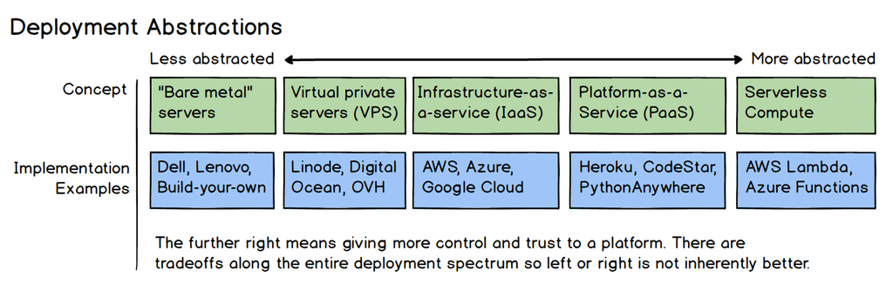

# Linode Terraform provisioning training material

## The intention

The goal of this project is to define simple infrastructure as code scenarios targeting training materials.
The targeted audience are System Administrators who did not embrace the transformation toward abstracted computing.

*Credit goes to @lmammino for detailing accordingly the concepts around the evolution of the runtime here*

>From Ops to DevOps and from DevOps to No Ops

We want to help the system administrators to become SREs and to stat thinking a little bit more as software engineers.

Through simple cloud provisioning scenario, and service deployment, we will try to cover the most common use cases, while using the simplest approaches for deploying the same services from dedicated node to containers and then as functions.

>Keeping in simple and clean is the motto here.

## The motivation

We want to leverage the best infrastructure as code design patterns and practices.
In bigger corporations, there still a lot to be made for implementing an SRE culture (as well as real agility), that will bridge the gap between software designers and system administrators.

Another goal would be to train the technical instructors, by catalyzing their understanding on the explored capabilities.
By scaffolding the standard provisioning scenarios we'll try to provide as much abstraction and ideas to help them master the exposed subjects, thus helping us grow this beautiful community.

>100 000 000 subscribed accounts already

## The how to

For all phases, leveraging Github capabilities since they understand best the software delivery lifecycle (SDLC) and they back it well!

### Virtual private server phrase

* Leveraging Hashicorp Terraform to code the infrastructure provisioning.
* Leveraging Linode cloud provider since they understand best the developers needs

### Containerization phase

> TBD
>
### Function as a Service phase

> TBD

## AI

Artificial intelligence (ChatGPT, Pilot) will also be explored with the goal to leveraged as much as possible business cases that should not require our involvement anymore.

>Time is the most precious thing we have and we should invest it perfecting our understanding and resolving as much problems for the sake of the following generations

AI generated code snippets will be tagged and our engagement with these platforms explained.

## The philosophy

Since the wheel was already invented, the rule of engagement is to integrate as much as possible the existing solutions.
ti
The goal is to promote peace and solidarity so leveraging as much as possible open sourced framework will be the path to follow.

The training material promotes the positive embracement of technology and scaffolds the SDLC by leveraging as much as possible the CI/CD/SAST capabilities of Github SaaS.

> If by any chance it happened that you found this non marketed initiative, we'll be honored with your collaboration, sharing of ideas and best practices.

## The IaC covered scenarios

Feel free to contribute any common scenario that would benefit the transformation mouvement

### Deploying a Linux Node on the Cloud by script

Runtime: Linode SaaS, Terraform, Ubuntu 18 LTS
SDLC: Github, Visual Studio Code
